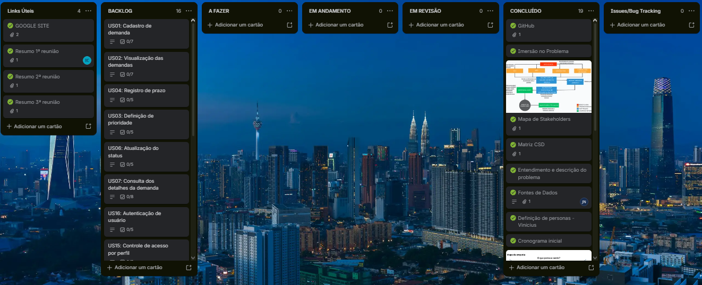
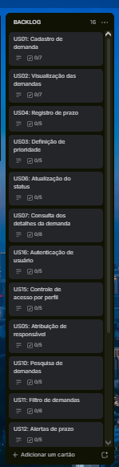

# VISAT

Sistema web para centralizar, organizar e acompanhar demandas do VISAT,
facilitando o controle de solicitações, inspeções, documentos, responsáveis
e andamento dos processos.

## 🎯 Sobre o projeto

O VISAT recebe demandas de diferentes instituições que podem resultar em
inspeções, análises e elaboração de documentos técnicos.

O projeto busca centralizar essas informações em um único sistema,
facilitando o acompanhamento das demandas e melhorando a organização
dos processos.

## 🚀 Objetivo

Desenvolver uma solução que permita:

- Centralizar as demandas recebidas;
- Acompanhar o andamento dos processos;
- Organizar informações e documentos;
- Controlar responsáveis e prazos;
- Melhorar a visualização das demandas e seus respectivos status.

## ⚙️ Funcionalidades

## 🛠️ Tecnologias

- HTML
- CSS
- JavaScript
- Python
- MySQL

## 📁 Estrutura do projeto

```text
src/
├── frontend/
├── backend/
└── database/
```

- **frontend/** — interface e elementos visuais do sistema.
- **backend/** — regras e funcionalidades da aplicação.
- **database/** — estrutura e comandos do banco de dados.

## 📋 Board

O desenvolvimento é organizado através de um Board Kanban:

**Backlog → A Fazer → Em Andamento → Em Revisão → Concluído**

O backlog possui no mínimo 15 Histórias de Usuário priorizadas, seguindo o padrão 3Cs: Card, Conversation e Confirmation.

🔗 [Acessar o Board do projeto](https://trello.com/b/er7tMowp/visat)

## 👥 Equipe

Projeto desenvolvido por estudantes de Sistemas de Informação.

- CAUÃ FERREIRA ARRUDA - Gerente de Projeto
  * Linkedin:
- ISABELLY RIBEIRO DO CARMO - Designer
  * Linkedin:
- JOÃO GABRIEL CASSIMIRO DE ARAUJO - Desenvolvedor Back-end
  * Linkedin:
- JOÃO PAULO DO NASCIMENTO - Product Owner (PO)
  * Linkedin: linkedin.com/in/jo%C3%A3o-nascimento-drones
- LETÍCIA CARVALHO BARBOSA - Designer
  * [Acessar o Linkedin](https://www.linkedin.com/in/surisavitriprocopioalves)
- SOFIA MARTINS VAN DRUNEN - Arquiteta de Software
- SURI SAVITRI PROCÓPIO ALVES - Analista de Requisitos
  * Linkedin: <linkedin.com/in/surisavitriprocopioalves>
- VINÍCIUS MACHADO LIMA - Desenvolvedor Front-end
  * Linkedin:

## 📸 Evidências

### Board atualizado



### Backlog priorizado



## 📌 Status

🚧 **Em desenvolvimento**

O projeto está sendo desenvolvido e novas funcionalidades serão adicionadas conforme as etapas do projeto avançarem.
