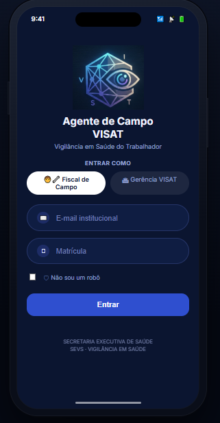

# 🔎 AGENTE DE CAMPO VISAT

<p align="center">
  
</p>

<p align="center">
  Sistema web para centralizar, organizar e acompanhar as demandas da Vigilância em Saúde do Trabalhador.
</p>

## 🎯 Sobre o projeto

O VISAT recebe demandas de diferentes instituições que podem resultar em inspeções, análises e documentos técnicos. O projeto centraliza essas informações, facilitando a comunicação entre os inspetores e o acompanhamento dos processos.

## 🚀 Objetivo

Desenvolver uma solução que permita:

- Centralizar as demandas recebidas;
- Acompanhar o andamento dos processos;
- Organizar informações e documentos;
- Controlar responsáveis e prazos;
- Melhorar a visualização das demandas e seus respectivos status.

## ⚙️ Funcionalidades

### 📋 Gestão de Ordens de Serviço

- Cadastro de Ordem de Serviço
- Definição de prioridade e registro de prazo
- Atribuição de responsável e atualização do status
- Consulta dos detalhes da demanda

### 📎 Gestão de Documentos e Inspeções

- Anexação de documentos
- Registro de inspeções e relatórios

### 🔎 Busca e Filtros

- Pesquisa e filtro de demandas

### 📊 Monitoramento e Indicadores

- Alertas de prazo
- Visualização do dashboard e consulta do histórico

### 🔐 Acesso ao Sistema

- Controle de acesso por perfil e autenticação de usuário

### 🏛️ Integração com o SEI

- Validação e vinculação de processo SEI
- Entrada de demandas externas pelo SEI

## 🎨 Protótipo

O protótipo do VISAT apresenta a proposta visual do sistema e permite visualizar a navegação entre as principais funcionalidades.

<p align="center">
  
</p>

<p align="center">
  <a href="https://claude.ai/artifact/SjXbqsXkbAX9fMj9x1Ec2A">
    <b>🔗 Acessar protótipo completo</b>
  </a>
</p>

## 📐 Diagramas

Os diagramas de atividades representam os fluxos das histórias de usuário do VISAT, detalhando as ações, decisões e responsabilidades envolvidas em cada funcionalidade.

<p align="center">
  <a href="https://claude.ai/artifact/Mb39gmjth4y6PLFV9LAeL5">
    <b>📁 Acessar todos os diagramas</b>
  </a>
</p>

## 🛠️ Tecnologias

<p align="center">
  
</p>

<p align="center">
  HTML • CSS • JavaScript • Python • MySQL • Git • GitHub
</p>

## 📁 Estrutura do projeto

```text
VISAT/
├── docs/
│   ├── banner-visat.png
│   ├── board.png
│   └── backlog.png
│
├── src/
│   ├── frontend/
│   ├── backend/
│   └── database/
│
├── .gitignore
├── README.md
└── requirements.txt
```

- **docs/** — imagens, evidências e documentação do projeto.
- **frontend/** — interface e elementos visuais do sistema.
- **backend/** — regras e funcionalidades da aplicação.
- **database/** — estrutura e comandos do banco de dados.

## 📋 Board

O desenvolvimento é organizado através de um Board Kanban:

**Backlog → A Fazer → Em Andamento → Em Revisão → Concluído**

O backlog possui no mínimo 15 Histórias de Usuário priorizadas, seguindo o padrão 3Cs: Card, Conversation e Confirmation.

<p align="center">
  
</p>

🔗 [Acessar o Board do projeto](https://trello.com/b/er7tMowp/visat)

## 👥 Equipe

Projeto desenvolvido por estudantes de Sistemas de Informação.

- [CAUÃ FERREIRA ARRUDA](https://www.linkedin.com/in/cauã-arruda-0b30563b0?utm_source=share_via&utm_content=profile&utm_medium=member_ios) - Gerente de Projeto
- [ISABELLY RIBEIRO DO CARMO](https://www.linkedin.com/in/isabellyribeiroc?utm_source=share_via&utm_content=profile&utm_medium=member_ios) - Designer
- [JOÃO GABRIEL CASSIMIRO DE ARAUJO](https://www.linkedin.com/in/joao-cassimiro?utm_source=share_via&utm_content=profile&utm_medium=member_ios) - Desenvolvedor Back-end
- [JOÃO PAULO DO NASCIMENTO](https://www.linkedin.com/in/joão-nascimento-drones?utm_source=share_via&utm_content=profile&utm_medium=member_android) - Product Owner (PO)
- [LETÍCIA CARVALHO BARBOSA](https://www.linkedin.com/in/leticiacarvalhobarbosa/) - Designer
- [SOFIA MARTINS VAN DRUNEN](https://www.linkedin.com/in/sofia-martins-van-drunen-096a08426/) - Arquiteta de Software
- [SURI SAVITRI PROCÓPIO ALVES](https://www.linkedin.com/in/surisavitriprocopioalves) - Analista de Requisitos
- [VINÍCIUS MACHADO LIMA](https://www.linkedin.com/in/vinicius-machado-lima-5a4100406?utm_source=share_via&utm_content=profile&utm_medium=member_android) - Desenvolvedor Front-end

## 📌 Status

🚧 **Em desenvolvimento**
